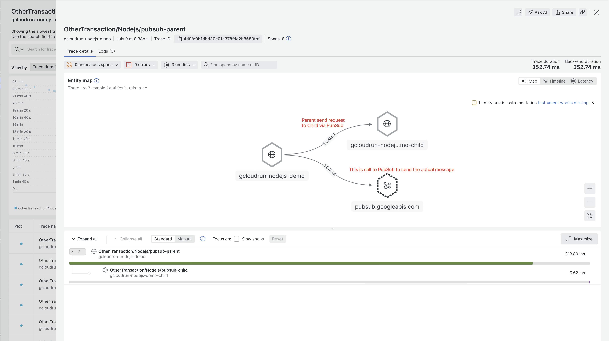
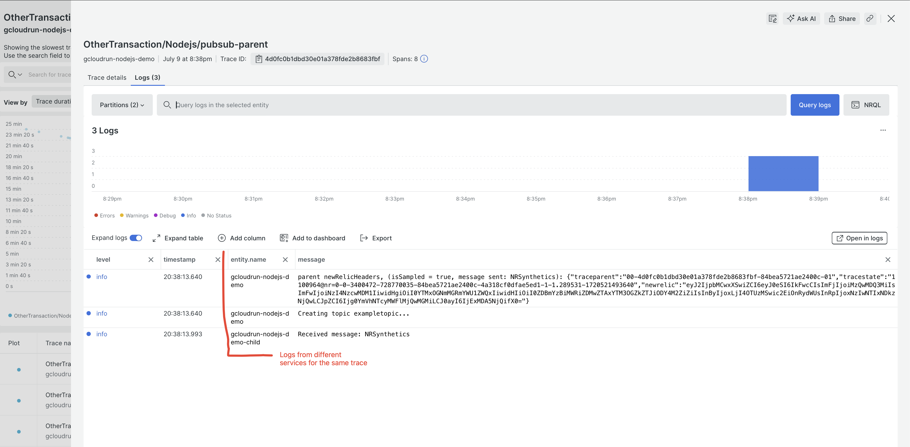

# Install
- install gcloud tool at https://cloud.google.com/sdk/docs/install
- run `gcloud init` and create new project
- make sure this project is linked to a billing account https://cloud.google.com/billing/docs/how-to/modify-project
- set default project `gcloud config set project PROJECT_ID`
- run locally by

```bash
npm install
npm run start
curl localhost:8080
```

- deploy to GCloud by running `gcloud run deploy`, at the end it will give you an URL where the Cloud Run is deployed

# Add New Relic NodeJS APM to GCloud Run
- run `npm install newrelic dotenv`
- add .env file to the root of the folder

```dotenv
NEW_RELIC_NO_CONFIG_FILE=true
NEW_RELIC_LICENSE_KEY=xxxxxx1FFFFNRAL
NEW_RELIC_APP_NAME=gcloudrun-nodejs-demo
NEW_RELIC_DISTRIBUTED_TRACING_ENABLED=true
```

- add the following to the start of the index.js file

```javascript
import 'dotenv/config';
import newrelic from 'newrelic';
```

- run the app locally again using `npm run start` and after 5 minutes you will see data in your New Relic account under APM Services tab

- deploy to GCloud Run

```bash
gcloud run deploy --update-env-vars NEW_RELIC_NO_CONFIG_FILE=true,NEW_RELIC_LICENSE_KEY=xxxxxx1FFFFNRAL,NEW_RELIC_APP_NAME=gcloudrun-nodejs-demo,NEW_RELIC_DISTRIBUTED_TRACING_ENABLED=true
```

# Add PubSub client

- authenticate using `gcloud auth application-default login`
- add pubsub client using https://cloud.google.com/nodejs/docs/reference/pubsub/latest#using-the-client-library

# Add Distributed Tracing using NewRelic NodeJS SDK

- Calling (parent) service can be instrumented like this

```js
app.get('/pubsub', async (req, res) => {
  const msg = req.query.message || 'Hello';
  const newRelicHeaders = {};
  newrelic.startBackgroundTransaction('pubsub-background', async function executeTransaction() {
    const transaction = newrelic.getTransaction();
    transaction.insertDistributedTraceHeaders(newRelicHeaders);

    const topic = await createTopicClient();
    topic.publishMessage({
      data: Buffer.from(msg),
      attributes: {
        ...newRelicHeaders
      }
    });
  });
});
```

- Called (child) service can be instrumented like this

```js
subscription.on('message', message => {
    const headersObject = message.attributes;
    newrelic.startBackgroundTransaction('pubsub-background', function executeTransaction() {
      const transaction = newrelic.getTransaction();
      transaction.acceptDistributedTraceHeaders('Queue', headersObject);
      transaction.end();
    });
  });
```

- redeploy, make sure the `--no-cpu-throttling` is on for the Child service otherwise DT will not work (since the New Relic APM agent sends the data in different thread to the main thread)

# Add Logs in Context
- install `winston` and `@newrelic/winston-enricher` package
- follow this https://newrelic.com/blog/how-to-relic/google-cloud-logs-agentless to forward GCloud logs to New Relic
- use the following code for the Log forwarder function instead [log-forwarder.js](./log-forwarder.js) (to flatten the nested JSON log)

# Example screenshots



